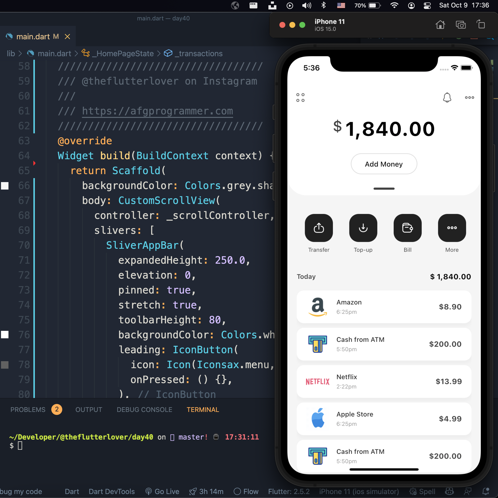
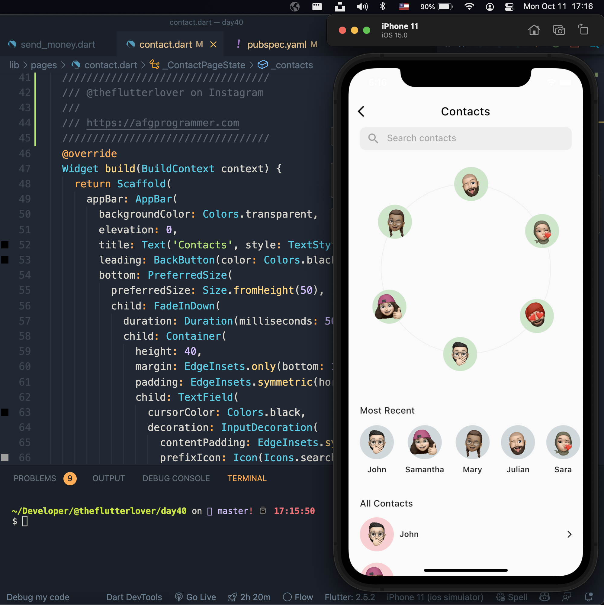
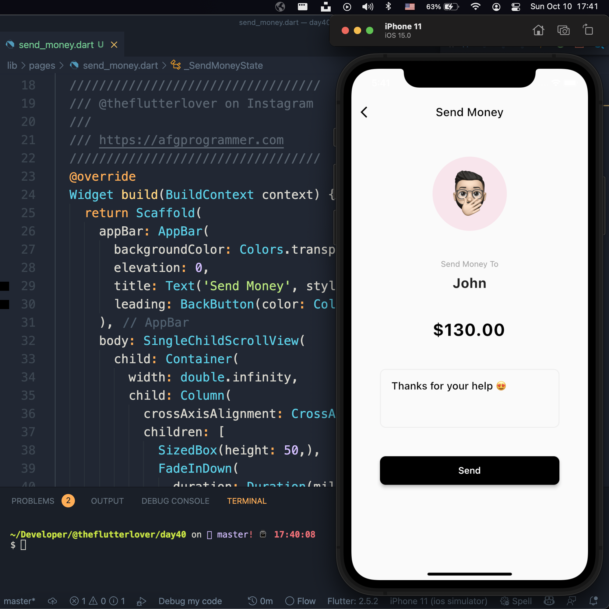
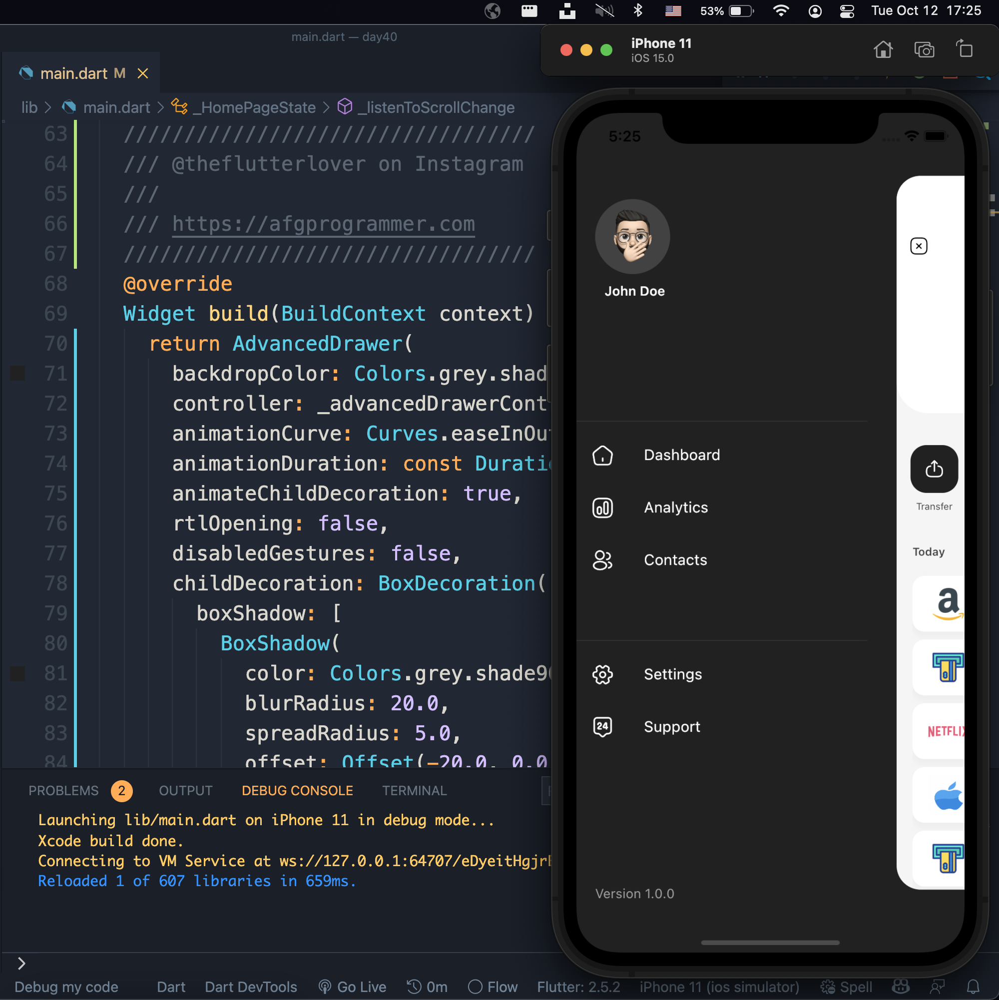

## Flutter Wallet Application Example - Day 40

```dart
class Afgprogrammer extends Flutter100DaysOfCode {
  video() {
    return {
      "title": "Flutter Wallet Application Example",
      "description": "Let’s make a wallet application.",
      "day": 40,
    }
  }
}
```

Assets 
* [icon8](https://icons8.com)

## Previous Designs
[Checkout my Youtube channel](https://youtube.com/afgprogrammer)


## Development Setup
Clone the repository and run the following commands:
```
flutter pub get
flutter run
```

## Screenshots

### Home Page


### Contact Page


### Send Money Page


### Contact Page


## Links

* [Website](https://afgprogrammer.com)
* [Youtube channel](https://youtube.com/afgprogrammer)
* [Twitter](https://twitter.com/afgprogrammer)
* [Instagram](https://instagram.com/afgprogrammer)
